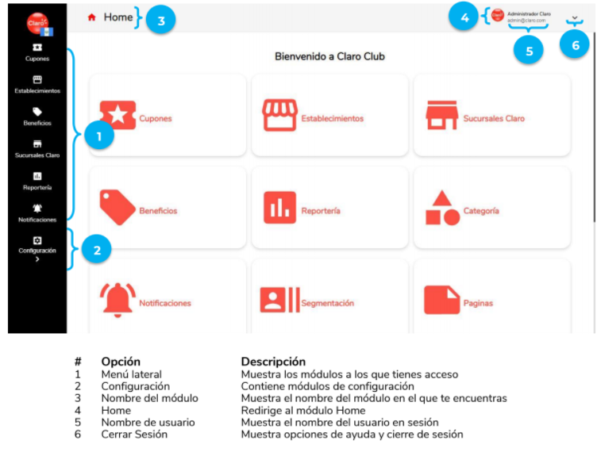

Cillum veniam veniam anim irure aute. Sint officia non ex nostrud ad nulla laboris ex labore magna. Ullamco exercitation nisi minim culpa mollit excepteur culpa adipisicing tempor labore incididunt.

Cillum commodo pariatur reprehenderit cupidatat qui nostrud ex reprehenderit velit Lorem veniam officia. Proident cupidatat cillum velit cupidatat irure nulla laborum occaecat excepteur. Sint eiusmod commodo elit culpa reprehenderit nostrud deserunt est elit.

## Propiedades de un usuario

Colons can be used to align columns.

| Propiedad     | Requerido     |
| ------------- | :-----------: |
| Nombre        | Sí            |
| Télefono      | Sí            |
| Email         | No            |

## 🟢 Visualización de usuario

## 🟡 Creación de usuario
<iframe width="560" height="315" src="https://pentcloud-development-team.s3.amazonaws.com/pentcloud/traze/Pentcloud+Partners.mp4" frameborder="0" allow="accelerometer;  clipboard-write; encrypted-media; gyroscope; picture-in-picture" allowfullscreen="1"></iframe>

## 🔵 Edición de usuario
<iframe width="560" height="315" src="https://pentcloud-development-team.s3.amazonaws.com/pentcloud/traze/Pentcloud+Partners.mp4" frameborder="0" allow="accelerometer;  clipboard-write; encrypted-media; gyroscope; picture-in-picture" allowfullscreen="1"></iframe>

## 🔴 Eliminación de usuario
<iframe width="560" height="315" src="https://pentcloud-development-team.s3.amazonaws.com/pentcloud/traze/Pentcloud+Partners.mp4" frameborder="0" allow="accelerometer;  clipboard-write; encrypted-media; gyroscope; picture-in-picture" allowfullscreen="1"></iframe>
